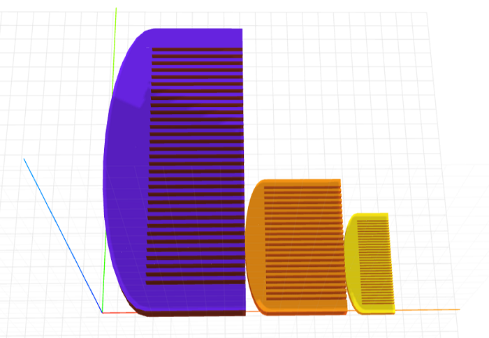

# craft-comb-calebhsu

Parameterized comb model.

### Install
	$ npm install craft-comb-calebhsu

### Parameters
- size: scales model
- width: adjusts width of comb
- length: adjusts length of comb
- height: adjusts thickness of comb

### Example
```html
<craft>
	<craft>
	<craft name="comb" module="craft-comb-calebhsu"/>
	<comb size="3"></comb>
	<comb size="2" length="10" width="6"></comb>
	<comb></comb>
</craft>
```

