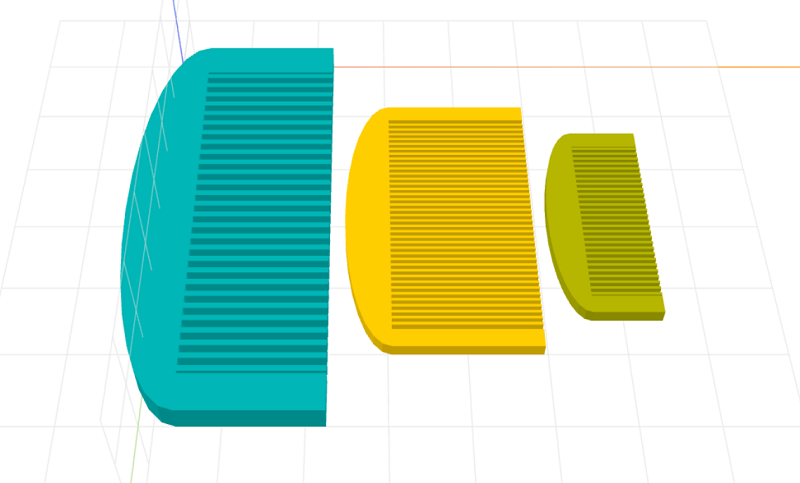

# craft-comb-calebhsu

Parameterized comb model.

### Install
	$ npm install craft-comb-calebhsu

### Parameters
- width: adjusts width of comb
- length: adjusts length of comb
- height: adjusts thickness of comb

### Example
```html
<craft>
	<craft name="comb" module="calebhsu/craft-comb"/>
	<lineup spacing="2">
		<scale factor="3">
			<comb></comb>
		</scale>
		<scale factor="2">
			<comb length="10" width="6"></comb>
		</scale>
		<comb></comb>
	</lineup>
</craft>
```

